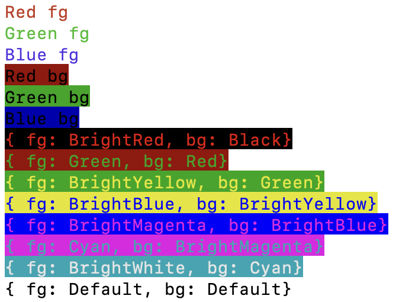
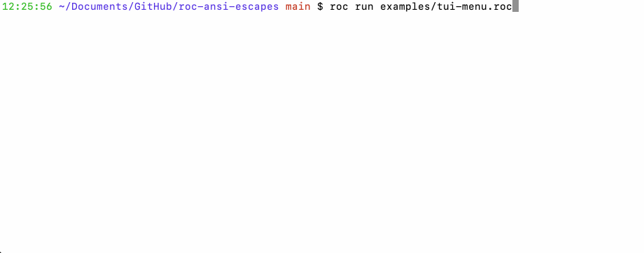
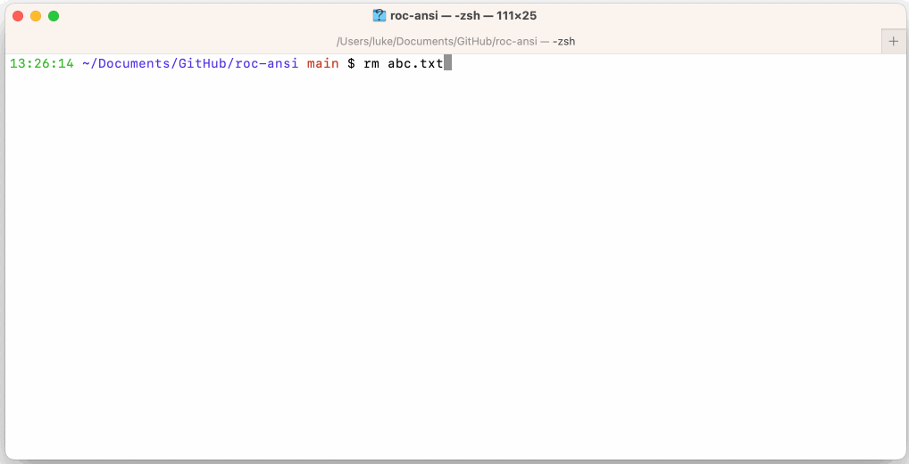

# Roc ANSI

Helpers for working with the terminal

## Example - Colors

Run with `roc run examples/colors.roc`

## Example - TUI Menu

Run with `roc run examples/tui-menu.roc`

## Example - Text Editor

Run with `roc run examples/text-editor.roc -- file_to_edit.txt`

## Documentation

See [https://lukewilliamboswell.github.io/roc-ansi/](https://lukewilliamboswell.github.io/roc-ansi/)

To generate locally use `roc docs package/main.roc`