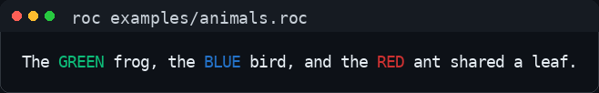
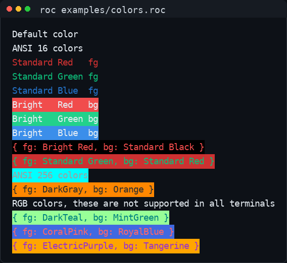
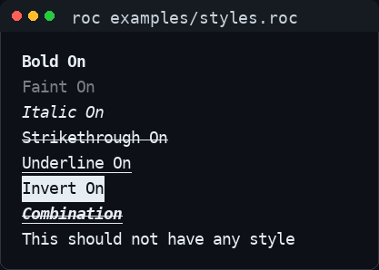
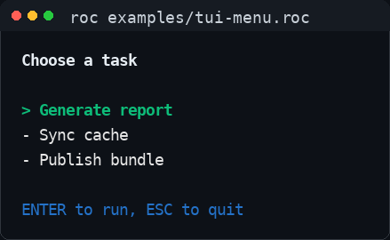
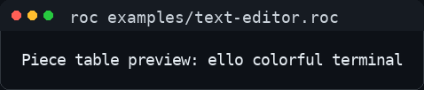

# Roc ANSI

Helpers for working with ANSI terminal control sequences in Roc.

## Example - Animals

Run with `roc examples/animals.roc`

## Example - Colors

Run with `roc examples/colors.roc`

## Example - Styles

Run with `roc examples/styles.roc`

## Example - TUI Menu

Run with `roc examples/tui-menu.roc`

## Example - Piece Table

Run with `roc examples/text-editor.roc`

## Documentation

See [https://lukewilliamboswell.github.io/roc-ansi/](https://lukewilliamboswell.github.io/roc-ansi/)

To generate locally use `roc docs package/main.roc --output=www`.
