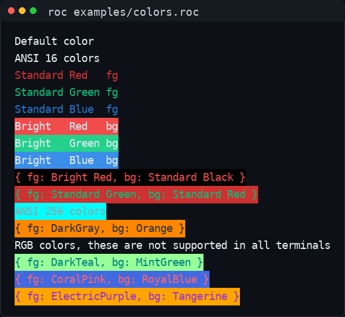
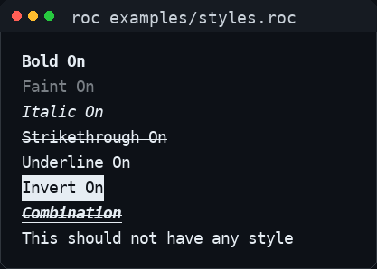
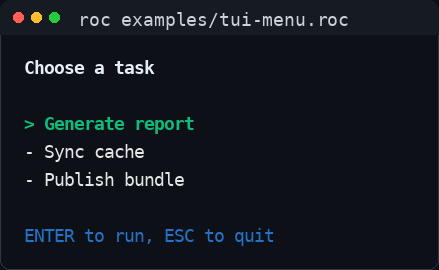
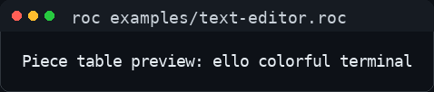

# Roc ANSI

Helpers for working with ANSI terminal control sequences in Roc.

## Example - Animals

Run with `roc examples/animals.roc`


## Example - Colors

Run with `roc examples/colors.roc`



## Example - Styles

Run with `roc examples/styles.roc`



## Example - TUI Menu

Run with `roc examples/tui-menu.roc`



## Example - Piece Table

Run with `roc examples/text-editor.roc`



## Documentation

See [https://lukewilliamboswell.github.io/roc-ansi/](https://lukewilliamboswell.github.io/roc-ansi/)

To generate versioned docs locally, use:

```sh
ROC=/path/to/roc python3 scripts/generate_docs.py 0.12.0
```

This also updates `www/index.html` to redirect to that version. Releases generate the new version, validate the complete site, and deploy the resulting Pages artifact automatically.

Generate the landing page with fresh main-branch API docs, then serve the isolated QA preview:

```sh
./scripts/serve_www.py
```

The preview chooses a free local port and opens it automatically; its landing page links to freshly generated `/main/` API docs. Pass `--no-open` to avoid opening a browser, `--no-serve` to only assemble the preview, or `--port 8000` to choose a fixed port. Set `ROC=/path/to/roc` if `roc` is not on your `PATH`.

The preview also includes rendered terminal captures and highlighted source for each runnable example at `/examples/`. The site vendors the Tree-sitter Roc grammar and web runtime for client-side highlighting; see [THIRD_PARTY_LICENSES.md](THIRD_PARTY_LICENSES.md) for license details.
