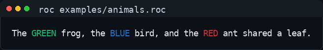
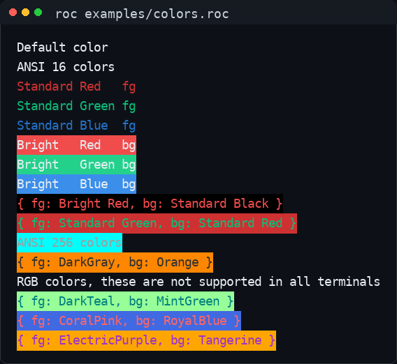
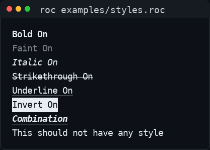
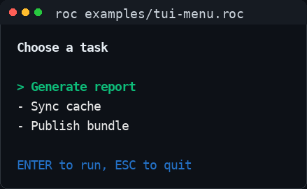
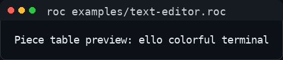

# Roc ANSI

Helpers for working with ANSI terminal control sequences in Roc.

## Example - Animals

Run with `roc examples/animals.roc`



## Example - Colors

Run with `roc examples/colors.roc`



## Example - Styles

Run with `roc examples/styles.roc`



## Example - TUI Menu

Run with `roc examples/tui-menu.roc`



## Example - Piece Table

Run with `roc examples/text-editor.roc`



## Development and CI

The checked-in examples use a relative path to the package source
(`ansi: "../package/main.roc"`), the [basic-cli](https://github.com/roc-lang/basic-cli)
platform release, and the development compiler pin. Running `roc examples/animals.roc`
therefore runs the example against the current source.

Each release attaches a frozen `roc-ansi-examples-VERSION.tar.gz` archive. Its
headers point at that release's immutable ANSI bundle URL and keep the compiler it
was published with. Download it from the release page to use the examples outside
this repository.

To test changes to `package/`, use the local scripts with the compiler pinned in
`package/main.roc` (set `ROC=/path/to/roc` to select the executable):

```sh
# Package format, checks, tests, docs, and all examples against local changes:
python3 scripts/all_tests.py

# Run one example against local changes, retaining terminal input/output:
python3 scripts/run_example.py animals

# Test all examples against an already-created bundle:
python3 scripts/test_bundle_examples.py --bundle-path dist/PACKAGE_HASH.tar.zst
```

The bundle script archives the working tree, serves it on a free localhost
port, and rewrites the ANSI dependency only in temporary example copies. The
server and temporary copies are cleaned up when the command exits.

CI exercises each compatibility promise separately:

- `test-examples` first runs the checked-in examples against the current source
  (`scripts/test_bundle_examples.py --current-source`). It then runs
  `scripts/published_examples.py test`, which downloads the latest release's examples
  archive and tests it with the released package and platform URLs unchanged,
  replacing only the compiler pin in temporary copies. A nightly that breaks what
  users download must fail this check. Until a release carries an examples archive,
  this lane reports a notice and skips.
- `Build release bundle` validates the working-tree package and examples;
  `Test default bundle (ubuntu-latest)` validates the exact proposed release
  archive through localhost. These checks cover changes that are not released yet.

Run the published compatibility check locally with:

```sh
python3 scripts/published_examples.py test
```

A passing current-source test does not override a failing published-release check.
Diagnose the break and prepare a compatible package release before accepting the
nightly update. CI never substitutes the local package for a released one.

## Releasing

After validating package changes, dispatch the **Release** workflow with a new
`release_version`. Its normal publication path:

1. Tests and bundles the working tree, then tests the exact archive through localhost.
2. Publishes the versioned release asset.
3. Packages the examples with headers rewritten to that asset's immutable URL,
   tests that archive against the published release, and attaches it to the
   release as `roc-ansi-examples-VERSION.tar.gz`.
4. Generates docs in ignored build output and uploads a versioned docs archive
   as a GitHub release asset. Pages restores these archives during deployment.

No follow-up PR is needed: the examples on `main` use relative paths and never
change for a release. The nightly updater auto-merges the compiler pins in
`package/main.roc` and the examples. Generated `roc docs` output is never committed.
PR and `nightly_validation` runs only validate; they never publish or deploy.

For maintenance-script changes, also run:

```sh
python3 -m unittest discover -s tests -v
```

## Documentation

See [https://lukewilliamboswell.github.io/roc-ansi/](https://lukewilliamboswell.github.io/roc-ansi/)

To generate versioned docs locally, use:

```sh
ROC=/path/to/roc python3 scripts/generate_docs.py VERSION
```

Output goes to `.roc-ansi-tmp/release-docs/VERSION`, outside the tracked site source.
Generated API docs are not committed. Release workflows upload archives named
`roc-ansi-docs-VERSION.tar.gz` alongside the package assets. Pages deployments
restore those archives and generate fresh `/main/` docs, preserving historical
version URLs without storing their HTML in Git.

To preview the complete site, including released documentation:

```sh
python3 scripts/assemble_www.py --fetch-release-docs
```

This downloads documentation assets from GitHub. The normal local preview below
only generates `/main/` docs and does not need that download. Hand-maintained site
files and vendored highlighting assets remain in `www/`.

Generate the landing page with fresh main-branch API docs, then serve the isolated QA preview:

```sh
./scripts/serve_www.py
```

The preview chooses a free local port and opens it automatically; its landing page links to freshly generated `/main/` API docs. Pass `--no-open` to avoid opening a browser, `--no-serve` to only assemble the preview, or `--port 8000` to choose a fixed port. Set `ROC=/path/to/roc` if `roc` is not on your `PATH`.

The landing page shows a terminal capture for each runnable example, linking to its source on GitHub. The site vendors the Tree-sitter Roc grammar and web runtime for client-side highlighting; see [THIRD_PARTY_LICENSES.md](THIRD_PARTY_LICENSES.md) for license details.
